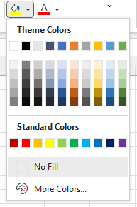
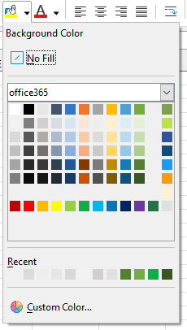

# libreoffice-palette-office365

This repository contains a `.soc` custom palette file with Microsoft Office 365 Colour Palette for Libre Office.

All colours are picked manually from Excel.

Along to these colours, I also added some other colours I often use in my projects and documents.

| Excel | Calc |
:------:|:-----:
 | 

## Installation

### Windows

Simply copy file `office365.soc` to directory `C:\Users\USERNAME\AppData\Roaming\LibreOffice\4\user\config\` and restart LibreOffice.

Don't forget to replace `USERNAME` with your real system username!

### GNU/Linux

Simply copy file `office365.soc` to directory `~/.config/libreoffice/4/user/config/` and restart LibreOffice.

